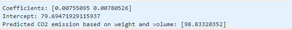

# Implementation of Multivariate-Linear-Regression
## AIM:
To write a python program to implement multivariate linear regression and predict the output.
## EQUIPEMENT'S REQUIRED: 
PC
Anaconda - Python 3.7
## ALGORITHM: 
### Step 1:
Import pandas library.
### Step 2: 
 Import linear_modal from sklearn.
### Step 3: 
Read the csv file using pandas library.
### Step 4:  
Enter the parameters of the linear function.
### Step 5: 
print the parameters of the linear function.
### Step 6: 
End the program.
## PROGRAM:
```
import pandas as pd
from sklearn import linear_model
df=pd.read_csv("cars.csv")
X=df[['Weight','Volume']]
Y=df['CO2']
regr=linear_model.LinearRegression()
regr.fit(X,Y)
print('Coefficients:',regr.coef_)
print("Intercept:",regr.intercept_)
predictedCO2=regr.predict([[1995,522]])
print("Predicted CO2 emission based on weight and volume:",predictedCO2)
```
### OUTPUT:



## RESULT:
Thus the multivariate linear regression is implemented and predicted the output using python program.
